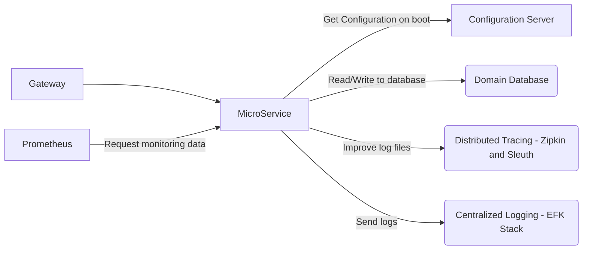
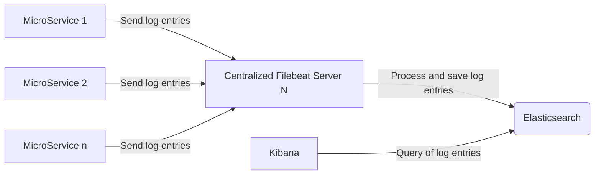

# AIB-template-repository

It is based on version 3.1.1 of Spring Boot and 17 of Java.

## Way of working for the development of the microservice

The microservice has been prepared so that when it starts it connects to a configuration server and downloads the configuration it needs.  
As the above is not comfortable for programmer work, it is recommended to set the profile is configured as `local`, this way you do not need a configuration server or other additional service of the platform.

### Coding Conventions / Processes

- Use the `CHANGELOG.md` file, which uses the [Keep a Changelog](https://keepachangelog.com/en/1.0.0/) standard to track changes in the code.
- Use [Semantic Versioning 2.0.0](https://semver.org/spec/v2.0.0.html) to choose a new version of the microservice.
- Use [git flow](https://www.atlassian.com/git/tutorials/comparing-workflows/gitflow-workflow)
  - `feature/*` branches MUST be reviewed by another developer before merge
  - `feature/*` branches MUST add a new entry in the `Unreleased` section of the `CHANGELOG.md` before merge
  - `release/*` and `hotfix/*` branches MUST update the `version` in the `build.gradle` and in the `Dockerfile` and create a new section for the version in the `CHANGELOG.md`
 
## Ecosystem for which the template is prepared:



### General microservice configuration:

The specific variables of the microservice are the following:

```ini
PORT=8080
```

### Configuration server

This service is responsible for returning the microservice configuration, based on its name and the destination environment (PROFILE). It is based on the [Spring Cloud Config](https://cloud.spring.io/spring-cloud-config/reference/html/).  
To configure it, the following environment variables must be modified:

```ini
CONFIG_URI=http://localhost:8888
```

This service is not deactivatable, outside the development environment.

### Gateway

This service is responsible to provide a simple yet effective way to route to APIs and provide cross cutting concers to them such as: security, monitoring/metrics, and resiliency. It is based on [Spring Cloud Netflix Zuul](https://cloud.spring.io/spring-cloud-netflix/multi/multi__router_and_filter_zuul.html).

# Centralized logging

In order for the service to have centralized logging, the `logback-spring.xml` file has to be modified so that messages can be sent to a centralized LogStash service.



To be able to do this, you have to modify the appender that was in the file and leave it as follows:

```xml
<?xml version="1.0" encoding="UTF-8"?>
<configuration>

    <include resource="org/springframework/boot/logging/logback/defaults.xml"/>
    <include resource="org/springframework/boot/logging/logback/console-appender.xml"/>

    <property name="LOG_FILE" value="${LOG_FILE:-${LOG_PATH:-${LOG_TEMP:-${java.io.tmpdir:-/tmp}}/}spring.log}"/>
    <include resource="org/springframework/boot/logging/logback/file-appender.xml"/>

    <springProperty name="app" source="spring.application.name"/>

    <springProfile name="local">
        <root level="info">
            <appender-ref ref="CONSOLE"/>
        </root>
    </springProfile>

    <springProfile name="!local">
        <appender name="FILE" class="ch.qos.logback.core.FileAppender">
            <file>logs/logs.log</file>
            <append>true</append>
            <encoder>
                <pattern>
                    {"level": "%level", "X-B3-SpanId": "%X{spanId:-}", "X-B3-TraceId": "%X{traceId:-}", "service": "${app:-}", "logger": "%logger", "pid": "${PID:-}", "thread": "%thread", "message": "%replace(%replace(%replace(%msg){'\n','\\n'}){'\t','\\t'}){'"','\\"'}", "throwable": "%replace(%replace(%replace(%ex){'\n','\\n'}){'\t','\\t'}){'"','\\"'}%nopex", "pod": "${HOSTNAME:-}"}%n
                </pattern>
            </encoder>
        </appender>

        <root level="info">
            <appender-ref ref="CONSOLE"/>
            <appender-ref ref="FILE"/>
        </root>
    </springProfile>

</configuration>
```

### Distributed Tracing

To get the microservices to have Distributed Tracing, use the tandem [Zipkin](https://zipkin.io/) - [Spring Cloud Sleuth](https://spring.io/projects/spring-cloud-sleuth).  
`TODO: add zipkin`

## Migration to Spring Boot 3

Some property key have been modified. To identify those properties, we can add the `spring-boot-properties-migrator` in our `build.gradle`:
```
implementation 'org.springframework.boot:spring-boot-properties-migrator'

```
This dependency generates a report, printed at start-up time, of deprecated property names, and temporarily migrates the properties at runtime.

## Common dependencies

#### Mapstruct
```
implementation 'org.mapstruct:mapstruct:1.5.5.Final'
annotationProcessor 'org.mapstruct:mapstruct-processor:1.5.5.Final'
```

#### Cache
```
implementation 'org.springframework.boot:spring-boot-starter-data-redis'

2.7.X
spring:
  redis:
    host: localhost
    port: 6379
  cache:
    type: redis
3.X.X
spring:
  data:
    redis:
      host: localhost
      port: 6379
  cache:
    type: redis
```

#### Rabbit
```
implementation 'org.springframework.boot:spring-boot-starter-amqp' // Publisher
implementation 'org.springframework.cloud:spring-cloud-stream-binder-rabbit' // Listener

spring:
  rabbitmq:
    host: localhost
    port: 5672
    username: guest
    password: 'guest'
  cloud:
    stream:
      rabbit:
        bindings:
          ...
      bindings:
        ...
```

#### MySQL
```
implementation 'org.springframework.boot:spring-boot-starter-data-jpa'
runtimeOnly 'com.mysql:mysql-connector-j'

spring:
  datasource:
    driver_class_name: com.mysql.cj.jdbc.Driver
    username: ...
    password: ...
    url: ...
  jpa:
    hibernate:
      ddl-auto: update
    properties:
      hibernate:
        dialect: org.hibernate.dialect.MySQLDialect (org.hibernate.dialect.MySQL8Dialect Spring 2.7)
    open-in-view: false
```

#### Elasticsearch
```
implementation 'org.springframework.data:spring-data-elasticsearch'

spring:
  elasticsearch:
    host: ...
    port: ...
    protocol: https
    username: ...
    password: ...
```

#### Tests
```
// Generator
testImplementation 'org.jeasy:easy-random-core:5.0.0'
// Testcontainers
testImplementation 'org.testcontainers:junit-jupiter:1.18.1'
testImplementation 'com.redis.testcontainers:testcontainers-redis-junit-jupiter:1.4.6' // Redis
testImplementation 'org.testcontainers:mysql:1.18.1' // MySQL
testImplementation 'org.testcontainers:neo4j:1.18.1' // Neo4j

```

# Config Deployment
Step-by-step guide on how to deploy a new service in the Kubernetes cluster using Github Actions. [Document](https://docs.google.com/document/d/1MRbYiBJ08Ed7euEeap0W_yEoqa92NBUbloht0X1YcHE/edit?usp=sharing)

<p align="center">
  <a>
    
  </a>
</p>

## Repo secrets
In order for the repository to have access to the Kubernetes cluster, the following repository secrets must be added to the variables and secrets configuration section "**GKE_PROJECT**" and "**GKE_SA_KEY**". Search in PSONO.

## Config Workflows

### Replace
You need to change in the deployment and workflow files the name of the service, replace "\aib-garage" with the name of the api, example: groups, users, bikes.

<p align="center">
  <a>
    
  </a>
</p>

### Deployment files
Also add and configure the deployment files in the ./deploy/ folder.
- /base/deployment.yml
  - Global deployment configuration
- /base/service.yml
  - Global deployment network configuration
- /overlays/develop/deployment.yml
  - Develop deployment configuration
- /overlays/production/deployment.yml
  - Production deployment configuration


## Resource allocation

In the development and production deployment.yml you can configure the resource request and limits following the table below.


<p align="center">
  <a>
    
  </a>
</p>

# Deployment
## Github actions
First, we are going to access a repository that already has the Kubernetes workflows configured, for them we must go to the Actions tab.


<p align="center">
  <a>
    
  </a>
</p>

Once in the Actions menu, you should see the 3 workflows configured in the right sidebar.

<p align="center">
  <a>
    
  </a>
</p>

### On push build
The main function of this workflow is to create a new build and publish it to the Google artifact repository automatically every time a push is made to the master branch.
This generates a list of application versions that can later be deployed to update the service without facing possible compilation problems.

<p align="center">
  <a>
    
  </a>
</p>

### Manual build
Very useful when you want to compile and/or deploy branches other than master.
The main function of this workflow is to create a new compilation and publish it in the Google artifact repository manually, for this it has a trigger (Run workflow) that will allow us to execute the action whenever we need it.

<p align="center">
  <a>
    
  </a>
</p>

Clicking this button displays a form that asks for the branch, the commit (complete format) that we want to compile and publish. If no commit is indicated by default, it will use the last commit of the selected branch.
Optionally, we can check the option to deploy after compiling, in this case we must indicate in which Namespace we want to deploy.

<p align="center">
  <a>
    
  </a>
</p>

### Manual deploy

Very useful when you want to deploy a commit, either to update or to roll back the version of a service that has an image already compiled and published in the Container Registry.
Select in Container Registry the commit you want to deploy.

<p align="center">
  <a>
    
  </a>
</p>

You can now deploy the new version of the service.

<p align="center">
  <a>
    
  </a>
</p>
